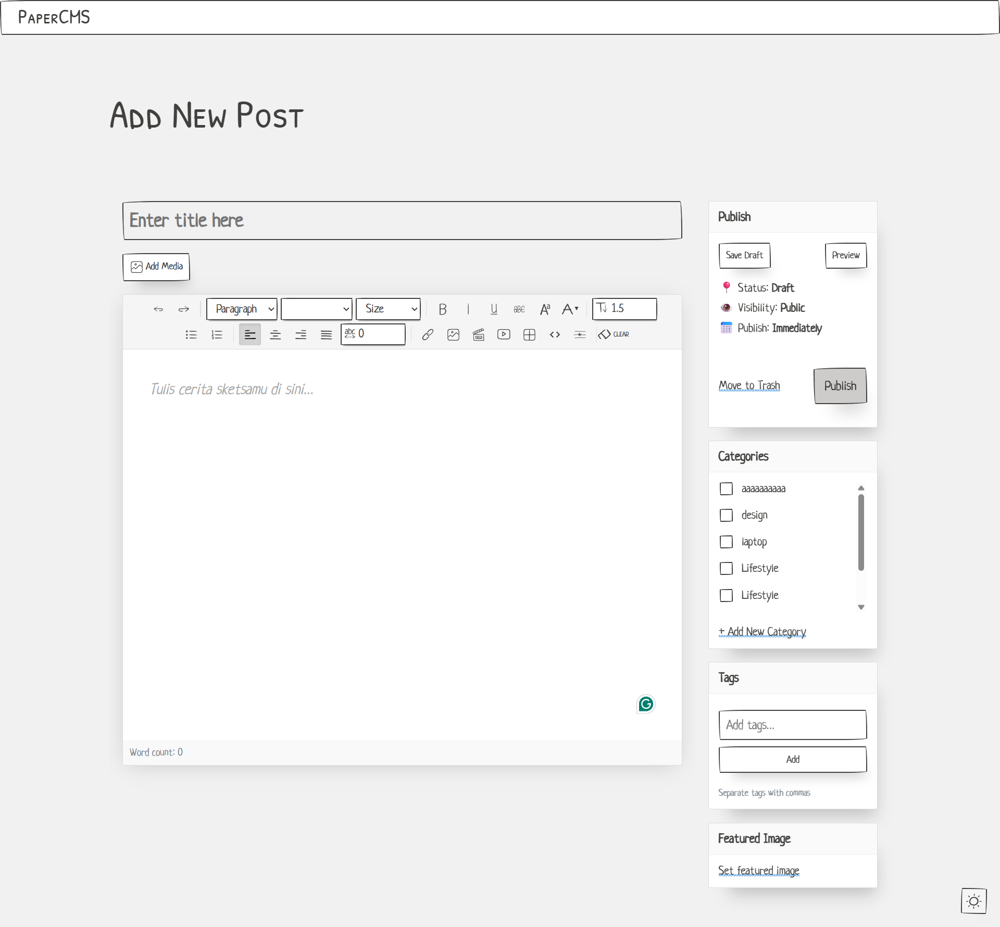
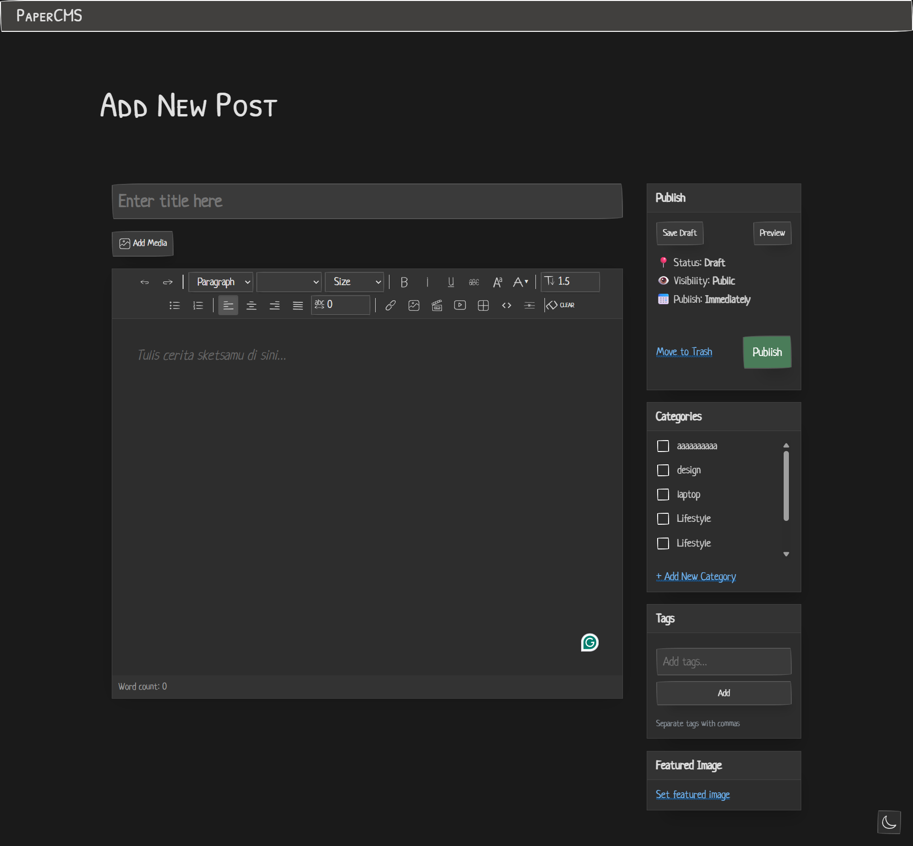

# 📝 Paper CMS

A lightweight, personal blogging CMS with a beautiful hand-drawn aesthetic powered by Paper CSS.

> ⚠️ **Personal Project** - This is a personal project built for learning and experimentation. Feel free to use it as a reference or fork it for your own use!


---

## ✨ Features

### 📰 Post Management
- **Rich Text Editor** - WYSIWYG editor with formatting toolbar
- **Syntax Highlighting** - Code blocks with Prism.js support
- **Draft & Publish** - Save drafts or publish instantly
- **Featured Images** - Set featured images for posts
- **Categories & Tags** - Organize posts with categories and tags
- **Visibility Options** - Public, private, or password-protected posts

### 🎨 Editor Features
- **Text Formatting** - Bold, italic, underline, strikethrough
- **Headings** - H1-H6 heading levels
- **Lists** - Ordered and unordered lists
- **Text & Background Colors** - Custom color picker
- **Font Selection** - Multiple font options
- **Code Blocks** - Syntax highlighted code with language selection
- **Media Manager** - Upload and insert images/videos
- **Link Insertion** - Easy hyperlink management
- **Block Quotes** - Styled quote blocks

### 🌓 User Experience
- **Dark Mode** - Toggle between light and dark themes
- **Responsive Design** - Works on desktop and mobile
- **Clean UI** - Hand-drawn aesthetic with Paper CSS

### 📁 Media Management
- **File Upload** - Drag & drop or click to upload
- **Media Library** - Browse and manage uploaded files
- **Image/Video Support** - Support for various media formats

---

## 🛠️ Tech Stack

- **Backend**: PHP 7.4+
- **Database**: MySQL 5.7+
- **Frontend**: HTML, CSS, JavaScript
- **CSS Framework**: [Paper CSS](https://www.getpapercss.com/)
- **Syntax Highlighting**: [Prism.js](https://prismjs.com/)

---

## 📦 Installation

1. **Clone the repository**
   ```bash
   git clone https://github.com/s4rt4/papercms.git
   ```

2. **Setup database**
   - Create a MySQL database
   - Import the schema from `database/schema.sql`

3. **Configure database connection**
   - Edit `includes/config.php` with your database credentials

4. **Run with local server**
   - Use XAMPP, Laragon, or any PHP development server
   - Access via `http://localhost/paper-cms`

---

## 📂 Project Structure

```
paper-cms/
├── api/                # API endpoints
│   ├── categories.php
│   ├── media.php
│   ├── posts.php
│   └── tags.php
├── assets/
│   ├── css/            # Prism.js themes
│   ├── font/           # Custom fonts
│   ├── icons/          # SVG icons
│   ├── js/             # JavaScript files
│   └── media/          # Uploaded media files
├── css/
│   ├── blog.css        # Blog page styles
│   └── paper.css       # Paper CSS framework
├── database/
│   └── schema.sql      # Database schema
├── includes/
│   ├── config.php      # Database configuration
│   ├── db.php          # Database connection
│   └── functions.php   # Helper functions
├── upload/             # Upload directory
├── blog.php            # Blog listing page
├── post.php            # Single post page
├── tambah-post.php     # Add/Edit post page
└── upload_handler.php  # File upload handler
```

---

## 📸 Screenshots

### Light Mode


### Dark Mode


---

## 📄 License

This project is licensed under the **MIT License** - see the [LICENSE](LICENSE) file for details.

---

## 🙏 Credits

- **[Paper CSS](https://www.getpapercss.com/)** - The beautiful hand-drawn CSS framework that powers the UI
- **[Prism.js](https://prismjs.com/)** - Syntax highlighting for code blocks
- **[UI Icons (Doodle Icons)](https://khushmeen.gumroad.com/l/doodleicons)** - Beautiful hand-drawn icon set used throughout the project (some icons modified)

---

## 👤 Author

**s4rt4**

- GitHub: [@s4rt4](https://github.com/s4rt4)

---

<p align="center">
  Made with ❤️ and ☕
</p>
